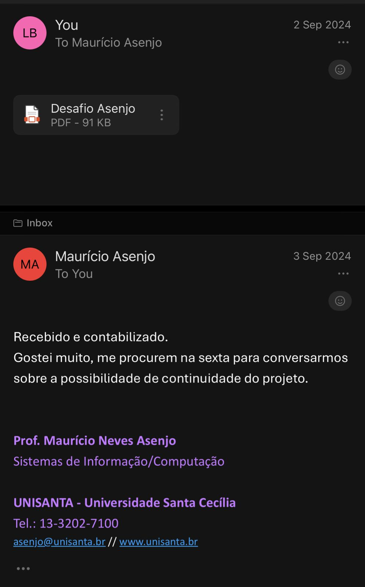

# Criptografia .NET

## 📝 Descrição

Este projeto implementa um algoritmo personalizado de criptografia simétrica desenvolvido como desafio acadêmico para a disciplina de Arquitetura de Computadores. O sistema utiliza uma abordagem matemática combinada com chave customizável para garantir a segurança dos dados.

## 🎓 Informações Acadêmicas

- **Disciplina**: Arquitetura de Computadores
- **Professor**: Mauricio Asenjo
- **Instituição**: Universidade Santa Cecília
- **Desenvolvedores**:
  - Lucas Barros Simon (RA: 235182)
  - Osi Paes Junior (RA: 237112)

## 📊 Avaliação do Professor



## 🔐 Algoritmo de Criptografia

### Premissas do Desafio

O algoritmo foi desenvolvido seguindo os requisitos específicos:

- ✅ Utilização de chave personalizável
- ✅ Combinação de pelo menos duas funções matemáticas
- ✅ Originalidade na implementação matemática

### Funcionamento Matemático

#### **Criptografia**

```
cCripto(i) = (cOriginal(i) + cChave(i mod comprimentoChave)) × 2
```

**Processo:**

1. Soma o valor ASCII do caractere original com o valor ASCII da chave
2. Aplica repetição cíclica da chave usando operador módulo
3. Multiplica o resultado por 2

#### **Descriptografia**

```
cDescripto(i) = (cCripto(i) ÷ 2) - cChave(i mod comprimentoChave)
```

**Processo:**

1. Divide o valor criptografado por 2
2. Subtrai o valor ASCII da chave correspondente
3. Converte de volta para caractere original

## 🚀 Funcionalidades

- **Interface Interativa**: Menu console para seleção de operações
- **Chave Personalizável**: Suporte a chaves de qualquer comprimento
- **Repetição Cíclica**: Processamento eficiente de textos maiores que a chave
- **Criptografia Bidirecional**: Suporte completo para criptografia e descriptografia
- **Otimização de Performance**: Utilização de `StringBuilder` para manipulação eficiente de strings

## 🛠️ Tecnologias Utilizadas

- **Linguagem**: C# (.NET 8.0)
- **Framework**: .NET Console Application
- **Estruturas de Dados**: StringBuilder para otimização
- **Paradigma**: Programação procedural com métodos estáticos

## 📋 Pré-requisitos

- .NET 8.0 SDK ou superior
- Windows/Linux/macOS
- IDE compatível (Visual Studio, VS Code, etc.)

## 🔧 Instalação e Execução

1. **Clone o repositório**

   ```bash
   git clone https://github.com/21lucasbarros/criptografia-dotnet.git
   cd criptografia-dotnet
   ```

2. **Execute o projeto**
   ```bash
   dotnet run
   ```

## 💡 Exemplo de Uso

```
1 - Criptografar
2 - Descriptografar
Escolha uma opção: 1
Digite a chave de criptografia: minhaChave
Digite o texto para criptografar: Hello World
Texto criptografado: [resultado criptografado]
```

## 🔒 Segurança

> **Aviso**: Este algoritmo foi desenvolvido para fins educacionais. Para aplicações em produção, recomenda-se o uso de algoritmos criptográficos estabelecidos e testados pela comunidade de segurança.

## 🏗️ Arquitetura do Código

```
Program.cs
├── Main() - Ponto de entrada e menu principal
├── ExecutarCriptografia() - Interface para criptografia
├── ExecutarDescriptografia() - Interface para descriptografia
├── Criptografia() - Implementação do algoritmo de criptografia
└── Descriptografia() - Implementação do algoritmo de descriptografia
```

## 📊 Complexidade Algorítmica

- **Tempo**: O(n), onde n é o comprimento do texto
- **Espaço**: O(n) para armazenamento do resultado
- **Chave**: Reutilização cíclica para textos de qualquer tamanho

## 🧪 Testes e Validação

O algoritmo garante a propriedade fundamental da criptografia simétrica:

```
Descriptografar(Criptografar(texto, chave), chave) = texto
```

## 🤝 Contribuição

Este projeto foi desenvolvido como trabalho acadêmico. Sugestões e melhorias são bem-vindas através de:

- Issues no GitHub
- Pull Requests
- Discussões acadêmicas

## 📞 Contato

- **Lucas Barros Simon** - [GitHub](https://github.com/21lucasbarros)
- **Osi Paes Junior** - Colaborador

## 🙏 Agradecimentos

- Professor Mauricio Asenjo pela proposta desafiadora
- Universidade Santa Cecília pelo ambiente acadêmico
- Comunidade .NET pelas melhores práticas implementadas

---

<div align="center">
Desenvolvido com carinho para a disciplina de Arquitetura de Computadores
</div>
